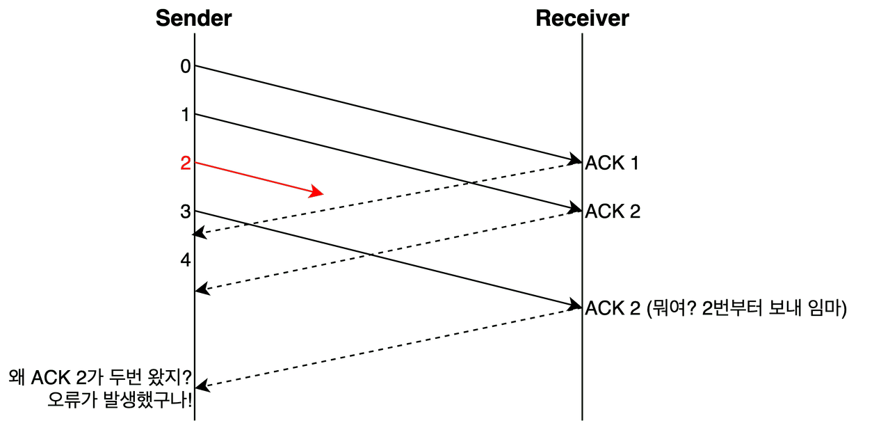
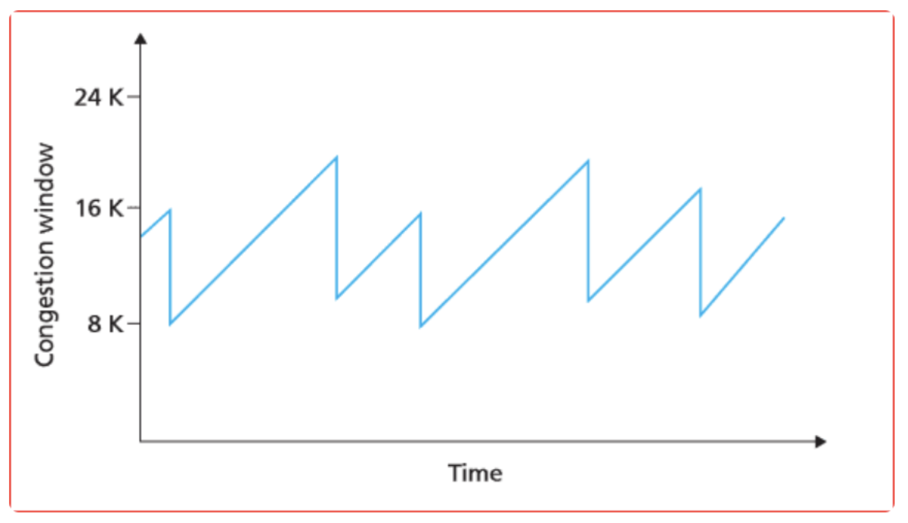

## 📆 2024-12-19

### 🔔 학습 목표

- [네트워크] 전송 계층 TCP와 UDP 정리

### 🚀 Today I Learned

#### 주제 1: TCP의 연결부터 종료까지

- 세그먼트: 전송 계층의 TCP 데이터 단위
- 데이터그램: 전송 계층의 UDP 데이터 단위
- 패킷: 네트워크 계층의 데이터 단위

#### 쓰리 웨이 핸드셰이크 : TCP의 연결 수립 과정

1. [A -> B] SYN 세그먼트 전송 : 제어 비트의 SYN 값이 1, 순서 번호는 100
2. [B -> A] SYN + ACK 세그먼트 전송 : 제어 비트의 SYN, ACK 값이 1, 순서 번호는 300, 확인 응답 번호는 101(호스트 A의 순서 번호 + 1)
3. [A -> B] ACK 세그먼트 전송 : 제어 비트의 ACK 값이 1, 순서 번호는 101, 확인 응답 번호는 301(호스트 B의 순서 번호 + 1)

#### 쓰리 웨이 핸드셰이크 예시

- 호스트 A '192.168.0.1' 와 호스트 B '10.10.10.1' 가 쓰리 웨이 핸드셰이크를 하는 상황
- 송신지 포트 번호(Source Port)는 49859, 수신지 포트 번호(Destination Port)는 80, 49859는 동적 포트, 80은 잘 알려진 포트로 HTTP에 해당한다.
- 즉, 해당 세그먼트는 A의 클라이언트 프로세스가 HTTP 서버인 B에게 연결 요청을 한 것이다.

#### 주제 2: TCP의 오류, 흐름, 혼잡 제어

#### TCP의 오류 제어

- 재전송을 통한 오류 제어: TCP는 송수신 과정에서 잘못 전송된 세그먼트가 있을 경우, 이를 재전송하여 오류를 제어한다.
- 중복된 ACK 세그먼트가 도착했을 때, 타임 아웃이 발생 했을 때 2가지 경우에 재전송한다.

- tcp 세그먼트는 재전송 타이머라는 값을 가지는데, 이 타이머가 다되면 타임 아웃이 발생한다.
  !(images/timeout.png)

- 파이프라이닝 전송: 오늘날의 TCP는 확인 응답을 받기 전이라도 여러 메시지를 보내는 방식으로 송신하며, 이를 파이프라이닝 이라고 한다.

#### TCP의 흐름 제어

- TCP의 흐름 제어는 수신 호스트가 한번에 받아 처리할 수 있을 만큼만 전송하는 것을 의미한다.
- 수신 호스트가 한번에 받을 수 있는 전송량은 TCP 수신 버퍼의 크기에 의해 결정된다.
- TCP 헤더에 window 라는 필드가 있는데, 여기에 수신 윈도우 크기가 명시된다. 이 수신 윈도우 값을 통해 송신 호스트에게 수신 호스트가 한번에 처리 가능한 양을 알려 준다.

#### TCP의 혼잡 제어

- 혼잡(congestion)은 많은 트래픽으로 읺해 패킷의 처리 속도가 느려지거나 유실될 수 있는 상황을 의미한다.
- 흐름 제어의 주체가 수신 호스트였다면 혼잡 제어의 주체는 송신 호스트이다. 송신 호스트가 얼마나 혼잡한지 판단하고 그에 따라 보낼 세그먼트의 양을 조절한다.
- 송신 호스트가 혼잡을 판단하는 기준은 오류 제어 때와 같다. 중복된 ACK, 타임 아웃 발생 2가지이다.
- <b>혼잡 윈도우</b>라는 값을 통해 전송할 세그먼트의 양을 조절한다. 혼잡 윈도우가 크면 한번에 많은 양의 세그먼트를 전송할 수 있고, 작으면 지금 혼잡하니까 적은 양의 세그먼트만 보내라는 뜻이다.
- 혼잡 윈도우와 수신 윈도우는 모두 커널 내에 정의된 값이다.

- AIMD: 혼잡제어 알고리즘 중 하나, 혼잡 윈도우의 크기를 조절하는 알고리즘이다.
- 세그먼트를 보내고 그에 대한 응답으로 혼잡이 감지되지 않으면 선형적으로 혼잡 윈도우를 1씩 증가시키고, 혼잡이 감지되면 절반으로 떨어뜨리는 동작을 반복

- RTT(Round Trip Time): 패킷을 보내고 그에 대한 응답이 수신되기까지의 시간, 따라서 AIMD에선 혼잡이 감지되지 않으면 RTT마다 혼잡 윈도우를 1씩 증가시키고, 혼잡이 감지되면 혼잡 윈도우를 절반으로 떨어뜨린다.

#### 주제 3: TCP의 종료

1. [A -> B] FIN 세그먼트, FIN 비트가 1
2. [B -> A] ACK 세그먼트
3. [B -> A] FIN 세그먼트
4. [A -> B] ACK 세그먼트

#### 주제 4: TCP의 상태 관리

- TCP는 Stateful protocol이다. 여기서 상태(state)란 현재 어떤 통신 과정에 있는지를 나타내는 정보를 말한다. TCP에는 다양한 상태가 존재하고, 호스트는 TCP를 통한 송수신 과정에서 다양한 상태를 오가게 된다.

#### TCP 상태 요약

| 상태         | 의미                          | 주요 특징                                                                                          |
| ------------ | ----------------------------- | -------------------------------------------------------------------------------------------------- |
| LISTEN       | 연결 요청 대기 상태           | 서버 소켓이 클라이언트의 연결 요청(SYN)을 기다리는 상태.                                           |
| SYN-SENT     | 클라이언트 연결 요청 상태     | 클라이언트가 SYN 패킷을 전송한 후 서버의 SYN+ACK 응답을 기다리는 상태.                             |
| SYN-RECEIVED | 서버 연결 대기 상태           | 서버가 클라이언트의 SYN을 받고, SYN+ACK를 보낸 후 클라이언트의 ACK 응답을 기다리는 상태.           |
| ESTABLISHED  | 데이터 송수신 가능 상태       | TCP 연결이 성공적으로 완료되어 양방향 데이터 통신이 가능한 상태.                                   |
| FIN-WAIT-1   | 연결 종료 요청 상태 (송신 측) | 송신자가 FIN 패킷을 보내고 상대방의 ACK 또는 FIN을 기다리는 상태.                                  |
| FIN-WAIT-2   | 연결 종료 대기 상태 (송신 측) | 송신자가 FIN에 대한 ACK를 받은 후, 상대방의 FIN 요청을 기다리는 상태.                              |
| CLOSE-WAIT   | 연결 종료 요청 상태 (수신 측) | 수신자가 FIN을 받고 ACK를 전송한 상태. 응용 프로그램이 소켓을 닫기를 기다림.                       |
| LAST-ACK     | 연결 종료 최종 ACK 대기 상태  | 수신 측이 FIN을 보낸 후, 상대방의 ACK를 기다리는 상태.                                             |
| TIME-WAIT    | 종료 확인 대기 상태           | 송신자가 FIN+ACK을 보낸 후, 네트워크 상에서 남아 있을 수 있는 패킷들을 대비해 일정 시간 동안 대기. |
| CLOSED       | 연결 완전 종료 상태           | 모든 연결이 종료되고, 소켓이 닫혀 더 이상 사용되지 않는 상태.                                      |

### 📰 참고 자료 및 링크

- 이것이 컴퓨터 과학이다 - 강민철
