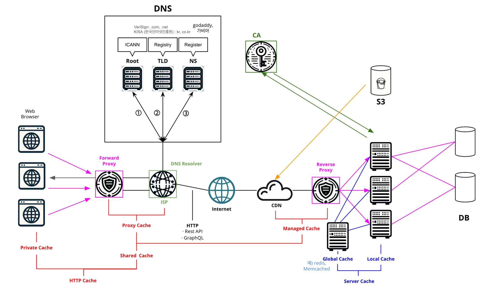

## 📆 2024-11-05

### 🔔 학습 목표
- 웹 응용 개념 복습

### 🚀 Today I Learned
#### 주제 1: 웹 구조

1. 도메인 이름 입력: 웹 브라우저에 HTTPS 프로토콜을 사용하여 도메인 이름을 입력
2. DNS 조회: DNS Resolver를 통해 입력된 도메인 이름을 IP 주소로 변환한 후 조회
    1. Root 서버: 최상위에 존재하고, 전체적인 도메인 시스템을 관리한다. 다음 단계인 TLD 서버의 위치 정보를 제공한다.
    2. TLD 서버 (Top-Level Domain 서버): 도메인의 최상위 수준에 해당하는 도메인을 관리하는 서버, 예를 들면 .com, .kr, .net 등이 있다. 다음 단계인 해당 도메인(.com, .kr, .net)에 해당하는 NS의 정보를 제공한다.
    3. Name 서버(NS): 도메인에 해당하는 정확한 IP 주소를 알려준다.
3. Forward Proxy (포워드 프록시) - 선택 : 클라이언트(사용자) 대신 서버와 통신하는 중개자 역할을 한다. 프록시 서버에 자주 사용되는 컨텐츠들을 캐싱해둘 수 있고, 사용자의 IP 주소를 숨길 수 있어 사용자의 개인정보를 보호할 수 있다.
4. 3-way handshake: DNS 조회로 얻은 IP 주소로 클라이언트(웹 브라우저)와 웹 서버 간의 TCP 연결을 시작하기 위해 3-way handshake가 수행된다.
    * 3-way handshake: TCP/IP 프로토콜을 이용해서 통신하기 전 연결 과정
        1. 클라이언트 ———(SYN)———> 서버
        2. 클라이언트 <———(ACK + SYN)——— 서버
        3. 클라이언트 ———(ACK)———> 서버
5. TLS handshake: 클라이언트와 서버가 안전한 연결을 위해 TLS handshake를 수행한다. 아래는 TLS handshake를 쉽게 이해하기 위한 예시이다.
`Client : 안녕하세요 ! 안전한 통신을 구축하고 싶습니다. 여기 제 TLS 버전 과 제가 알고있는 여러가지 암호알고리즘 이 있습니다. 

Server : 네 안녕하세요. 귀하의 암호 알고리즘들과 TLS 버전 을 확인했습니다. 음...귀하가 갖고있는 알고리즘에서 이 알고리즘을 사용하는 것이 좋을 것 같군요 ( Client 가 제시한 알고리즘 중 하나 선택 ) 
Server : 여기 제가 갖고있는 SSL 인증서 에 제 공개키 를 써서 드리겠습니다.Certificate
Server : ( SSL 인증서에 자신의 공개키가 없을 때 ) 아차 ! 제 공개 키를 깜빡했군요. 여기 제 공개 키 입니다 ( Server 가 Client 에게 직접 공개키 전달 / 만약 SSL 인증서에 자신의 공개 키가 들어있다면 이 구간은 생략한다 ) 

Client : 여기 내가 갖고있던 CA(인증기관)공개 키 로 Server 가 보내준 SSL 인증서 를 열어봐야겠다( CA 의 공개키로 복호화 가 성공했다면 이 SSL 인증서 는 CA 가 서명한 것이 맞는 셈이다 ). 이제 저와 당신만의 비밀 키 ( 공유 비밀 키 ) 를 생성하고, 이 비밀 키 를 당신이 준 공개키로 암호화 해서 보낼게요 

이제 Server 는 자신의 비밀 키 로 Client 가 보내준 공유 비밀 키를 복호화해서 열어본다. 그 후 Client, Server 서로가 교환할 정보를 모두 교환한 뒤 통신할 준비가 다 되었음을 알리는 ChangeCipherSpec 패킷을 보낸 뒤 Finished 패킷을 보내며 TLS Handshake 를 종료합니다`

### 🗨️ 오늘의 회고
- 웹 구조는 나중에 클라우드를 공부하기 위해 필수적으로 알고 있어야 하는 CS 지식이다.
반복적으로 학습하여 머릿속에 확실히 남겨두자.

### 📰 참고 자료 및 링크
- [TLS-handshake 예시](https://velog.io/@osk3856/TLS-Handshake#TLS-handshake)

